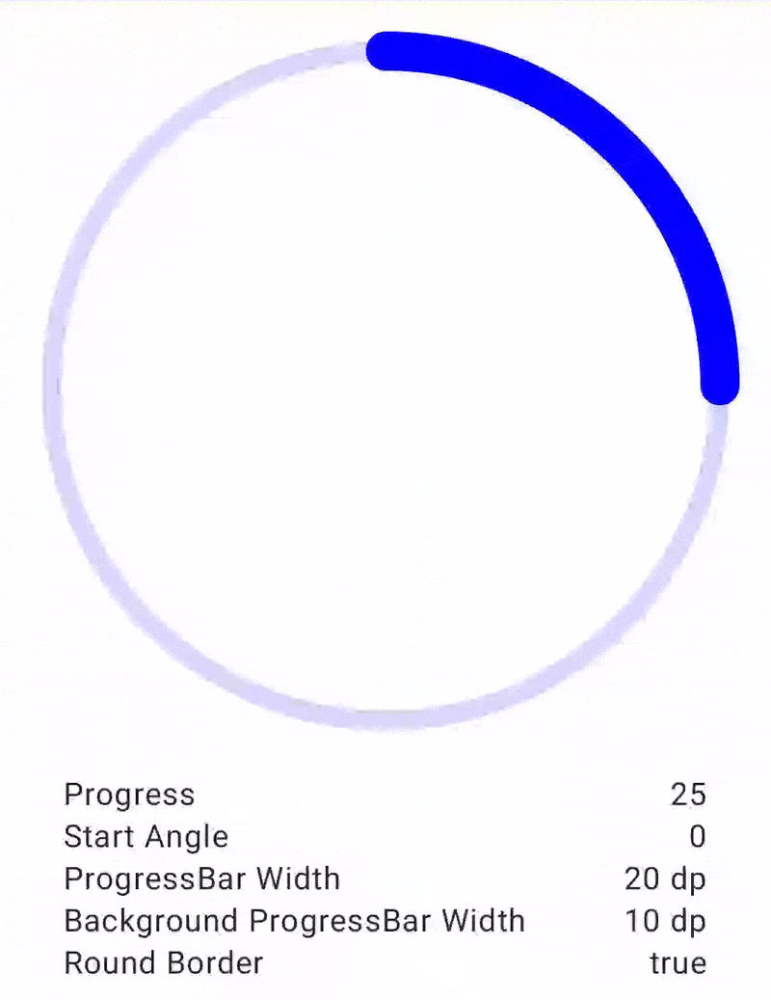

# CircularProgressBar for Jetpack Compose

An android library to easily add CircularProgressBar into your [Jetpack Compose](https://developer.android.com/jetpack/compose) apps.

## Have a Look


## Usage
```kotlin
CircularProgressBar(
    modifier = Modifier.size(120.dp),
    progress = 30f,
    progressMax = 100f,
    progressBarColor = Color.Blue,
    progressBarWidth = 20.dp,
    backgroundProgressBarColor = Color.Gray,
    backgroundProgressBarWidth = 10.dp,
    roundBorder = true,
    startAngle = 90f
)
```

## Supported Properties
| Property                        | Type       | Default        |
| ------------------------------- | ---------- | -------------- |
| `progress`                      | Float      | 0f             |
| `progressMax`                   | Float      | 100f           |
| `progressBarColor`              | Color      | Color.Black    |
| `progressBarWidth`              | Dp         | 7.dp           |
| `backgroundProgressBarColor`    | Color      | Color.Gray     |
| `backgroundProgressBarWidth`    | Dp         | 3.dp           |
| `roundBorder`                   | Boolean    | false          |
| `startAngle`                    | Float      | 0f             |

## Download
Add JitPack repository to your root `build.gradle` file
```
allprojects {
    repositories {
        maven { url 'https://jitpack.io' }
    }
}
```
Add the dependency to your app `build.gradle` file
```
dependencies {
    implementation 'com.github.hitanshu-dhawan:CircularProgressBar-Compose:1.0.0-rc01'
}
```

## Licence
```
Copyright (c) 2021 Hitanshu Dhawan

Licensed under the Apache License, Version 2.0 (the "License");
you may not use this file except in compliance with the License.
You may obtain a copy of the License at

http://www.apache.org/licenses/LICENSE-2.0

Unless required by applicable law or agreed to in writing, software
distributed under the License is distributed on an "AS IS" BASIS,
WITHOUT WARRANTIES OR CONDITIONS OF ANY KIND, either express or implied.
See the License for the specific language governing permissions and
limitations under the License.
```
